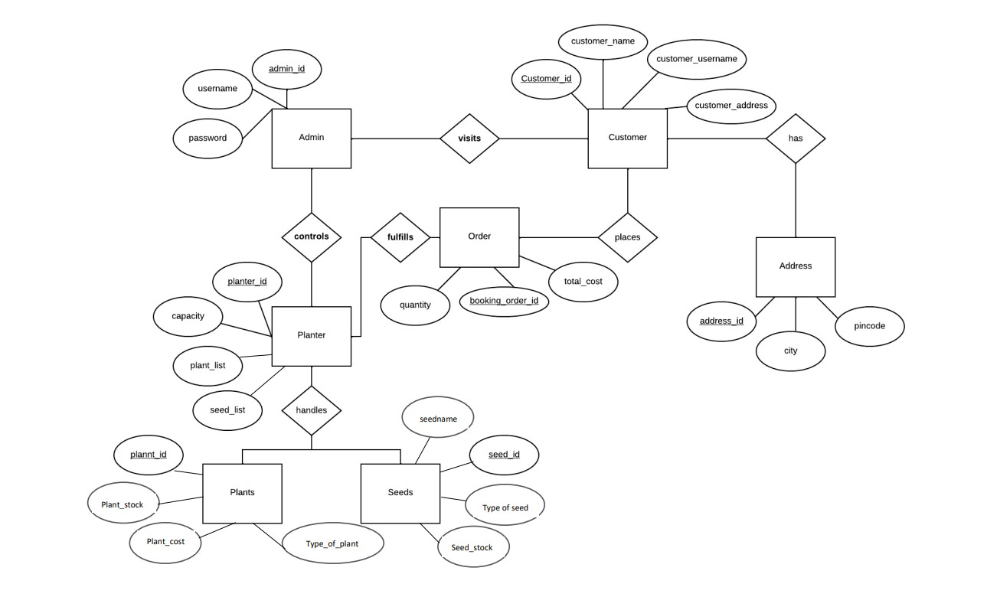

#  Online Plant Nursery Management 🌱 (GoGreen) 🌱

We made a Backend Application to Perform CRUD Operation and Made RestFul APIs Service Using java, SpringBoot, lombok and swagger-UI for Nursery Plant Application.In this project customer can signup, login, see planters,plants and seeds. Customer can order multiple orders with multiple plants,planters and seeds. Admin can Manage or can do CRUD Operation On Plants, Seeds, Planters and Customers.

This project is developed by team of 5 Back-end Developers during construct week in Masai School.

Group name - delicate-quite-4701

___________________________________________________________________________________________________________________________________________________________

# Tech Stacks: 🌱

* Java
* Spring Boot
* Maven
* Swagger-Ui
* Lombok
* MySql
* SpringData Jpa
* Hibernate

# Modules 🌱

* Login, Logout Module
* Admin Module
* Plants Module
* Planters Module
* Seeds Module

# Entity RelationShip Diagram 🌱

# Features 🌱

* User and Admin authentication & validation with session uuid.

# Admin Features:

* Administrator Role of the entire application
* Only admins can add/update/delete plants, planters, seeds from main database
* Admin can access the details of different users and orders.

# User Features:

* Registering themselves with application, and logging in to get the valid session token
* Viewing list of available plants, planters, seeds and order items of them.
* Only logged in user can access his orders, profile updation and other features.

# Installation & Run 🌱

Before running the API server, you should update the database config inside the application.properties file.

Update the port number, username and password as per your local database config. server.port=8886

spring.datasource.url=jdbc:mysql://localhost:3306/Gogreen spring.datasource.driver-class-name=com.mysql.cj.jdbc.Driver spring.datasource.username=mysql username spring.datasource.password=YourPassword spring.jpa.hibernate.ddl-auto=update

API Root Endpoint https://localhost:8800/

-http://localhost:8800/swagger-ui/

# Lessons Learned 🌱

* Gain excessive knowledge on application of Java, Swagger-Ui, Lombok ,MySql,SpringData Jpa & Hibernat.
* Got to know how to collabrate with team members.
* Enjoyed the process of learning and creating the product.

# Contributors 🌱

* [Pallavi Bobale](https://github.com/Pallu27899) (Team Lead)
* [Nafisa Parveen](https://github.com/Nafisa1117)
* [Shanu Kumrawat](https://github.com/shanukumrawat)
* [Sameer Bhavar](https://github.com/sameerbhavar)
* [Rajiv Suting](https://github.com/rajivsuting)
